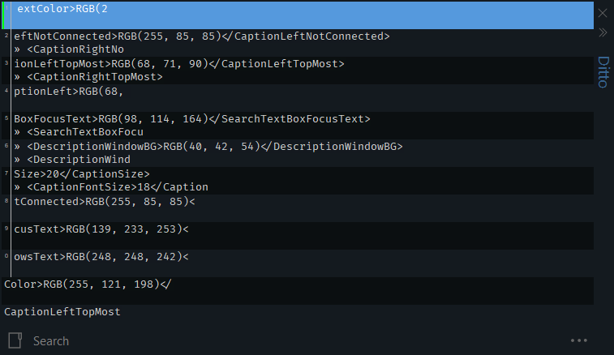

# theBestDittoTheme for [Ditto](https://ditto-cp.sourceforge.io/)

This Ditto theme is inspired by [The Best Theme](https://github.com/jankohlbach/The-Best-Theme) by [jankohlbach](https://github.com/jankohlbach/the-best-theme/commits?author=jankohlbach)

## Installation

1. Put the xml file inside the Themes folder of your [Ditto](https://ditto-cp.sourceforge.io/) installation
2. Inside [Ditto](https://ditto-cp.sourceforge.io/) navigate to "Options" -> "General" -> "Theme" and select your new Theme
