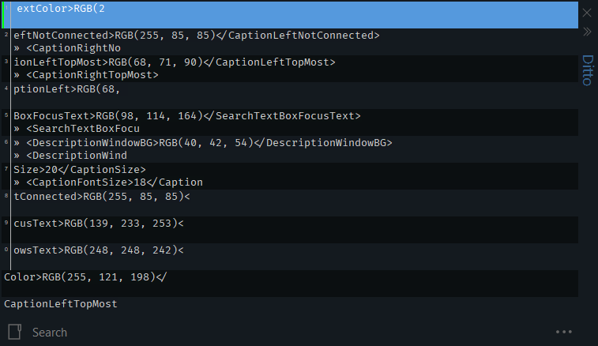

# theBestDittoTheme for [Ditto](https://ditto-cp.sourceforge.io/)

A dark, minimal theme for [Ditto](https://ditto-cp.sourceforge.io/), the open-source Windows clipboard manager. Inspired by [The Best Theme](https://github.com/jankohlbach/The-Best-Theme) by [jankohlbach](https://github.com/jankohlbach).

## About Ditto

[Ditto](https://ditto-cp.sourceforge.io/) is a free, open-source clipboard manager for Windows that keeps a searchable history of everything you copy (text, images, HTML) and lets you paste any past entry with a quick hotkey.

## Installation

1. Download `theBestDittoTheme.xml` from this repository.
2. Place the file inside the `Themes` folder of your [Ditto](https://ditto-cp.sourceforge.io/) installation (typically `C:\Program Files (x86)\Ditto\Themes` or `%AppData%\Ditto\Themes`).
3. Open Ditto and navigate to **Options → General → Theme**.
4. Select `theBestDittoTheme` from the dropdown and click **OK**.

## Usage

Once selected, the theme is applied immediately to the Ditto clipboard window. To switch back, choose a different theme from the same menu. No restart required.

## Updating

Replace the existing `theBestDittoTheme.xml` in your `Themes` folder with the latest version from this repository and reselect the theme in Ditto's options.

## Credits

- Original [The Best Theme](https://github.com/jankohlbach/The-Best-Theme) by [jankohlbach](https://github.com/jankohlbach) — color palette and design inspiration.
- [Ditto](https://ditto-cp.sourceforge.io/) by Scott Brogden — the clipboard manager this theme targets.

## License

Released under the MIT License. Free to use, modify, and distribute.

## Contributing

Issues and pull requests welcome. Open an issue with a screenshot if colors render incorrectly on your Ditto version.
